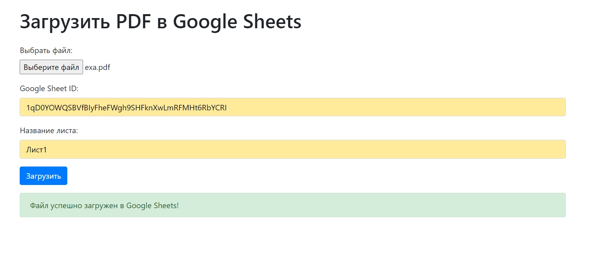

## Как запустить проект

Прежде чем запустить проект, убедитесь, что вы выполните следующие шаги:

### 1. Регистрация на Google API

Перейдите на [Google Cloud Console](https://console.cloud.google.com/), зарегистрируйтесь или войдите в свою учетную запись Google.

### 2. Создание сервисного аккаунта

1. В левой боковой панели выберите "IAM и администрирование" > "Сервисные аккаунты".
2. Нажмите на "Создать сервисный аккаунт".
3. Укажите имя и описание для вашего сервисного аккаунта и нажмите "Создать".
4. Назначьте роль "Редактор" для созданного сервисного аккаунта.

### 3. Создание API ключа

1. В разделе "IAM и администрирование" выберите "API и сервисы" > "Учетные данные".
2. Нажмите на "Создать учетные данные" > "Ключ API" > "Ключ сервисного аккаунта".
3. Выберите свой сервисный аккаунт, укажите формат ключа JSON и нажмите "Создать".

### 4. Скачивание JSON ключа

Скачайте JSON-файл с ключом и сохраните его в корневой папке - credentionals.json

### 5. Создание Google Таблицы

Создайте новую Google Таблицу и добавьте адрес электронной почты вашего сервисного аккаунта в качестве редактора таблицы.

### 6. Запуск проекта

#### Клонируем репозиторий

```bash
git clone
```

#### Запускаем приложение в докер контейнере

```bash
docker compose up -d --build
```

### 7. Как пользоваться

1. Переходим на http://localhost:8000/
2. Загружаем нужны pdf файл
3. Вводим sheet_id и названия листа

#### Где взять sheet_id


#### Работающий интерфейс


